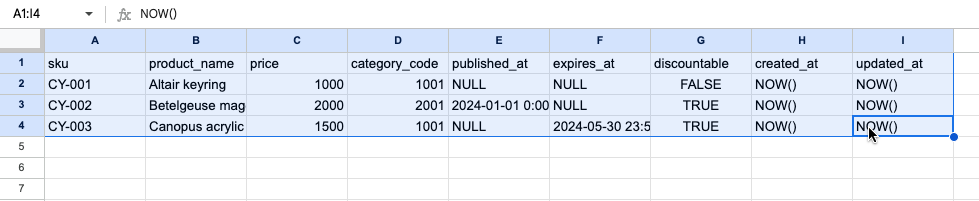

# tsv-to-insert-sql

Converts a TSV file to a SQL insert statement.

https://tsv-to-insert-sql.ytyng.com/

This is a tool to convert TSV text to Insert SQL.
It is useful when registering data created in Google Spreadsheets or Excel in a DB.

Select and copy the data created in Google Spreadsheets or Excel, and paste it into the text area at the bottom. When you press the Convert to Insert SQL button, an SQL statement is generated.

The processing is done in the browser, so the data is not sent.

The author is not responsible for any damage caused by using this tool. Please use it only if you agree.

これは、TSV 形式のテキストを Insert の SQL 文に変換するツールです。
Google スプレッドシートやエクセルで作ったデータを DB に登録する際に便利です。

Google スプレッドシートやエクセルで作ったデータを範囲選択し、コピーすると TSV 形式でコピーされるので、内容を下部のテキストエリアにペーストし、 Convert to Insert SQL ボタンを押すと SQL 文が生成されます。

処理はブラウザで行われるため、データは送信しません。

このツールを用いて発生した損害について、作者は一切の責任を負いません。同意できる方のみご利用ください。
